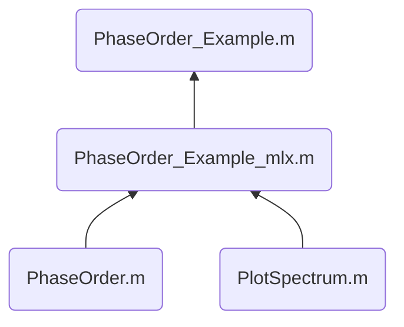

# Bootstrapped Switch

> used to model the distortion of Bootstrapped Switches and target to build a **high-speed low-distortion** Bootstrapped Switches.

## File Tree

### Model

- ✗ `Ron_Model.mlx`: plot the Ron figure based on the distortion data from Cadence Virtuoso Simulation；

- ✗ `Model_linear.mlx`: used the linear equation group of Ron and HD to calculate the  total distortion, **one point calculation**, -> ``getHD.m`

- ✗ `Model_basic.m`: calculate the Id and Vout of the Bootstrapped Switches and model the **relationship of Ron and THD**; **first try**

- ✗ `Model_basic_system.mlx`：building the Vout based on the distortion data from Cadence Virtuoso Simulation, try to  find the relationship between id and Vout;

- ✗ `Model_basic_Ron_Fourier.m` : used to represent the **Ron with Time** Xasix to calculated Fourier series;

- ✔︎`Id_getFR.m`: calculated the **frequency response of Id system**;

- ✔︎`getHD.m`: used the **linear equation group of Ron and HD** to calculate the  total distortion, with the variable fin and Ron, the function supportes the **vector** calculation;

- ✔︎`Model_DeltaRon.mlx`: analysis the relationship of Ron, Fin and HD, <- `getHD.m`;

  

### Simulink

- ✔︎`myr.scc`: basic model modified from the **variable resistor**;
  - **Input:** R (Ohm);
  - **Output:** Rout(Ohm) = Min{R_max, R};
- ✗ `Resistors.slx`, `Resistor_inverted.slx`: two simulation files of **myr.scc**;
- ✔︎`onSwitch.scc`: the MOSFET switch file modified from the **myr.scc**:
  - **Nodes**: 4 `electrical`, vp vn are used to sense the control voltage;
  - **Output:** Rout(Ohm) behavies like S D exchanged MOSFET;
- ✔︎`Boostrapped_Switch_v1.slx`,`Boostrapped_Switch_v2.slx`: the simulation files of **onSwitch.scc**
  - **Note:** the output signal is exported to the workspace to calculate the THD, by the file `Spectrum_Analysis.mlx`;
  - 

## Archive

### 010. Phase Order

**问题来源**：当输入信号频率 Fin 非常接近奈奎斯特频率 Fs/2 时，采样波形此时已无法看出波形的本质了，当我们使用 FFT 对信号进行处理时，**往往会忽略 FFT 信号中的相位信息**，对我们 debug 没有任何帮助；

**解决方法**：对输入信号**根据相位大小进行重排**，将原本N个看似“不完整“的正弦信号整理为 [0, 2*pi) 的一个正弦信号；

#### 文件结构：

#### 函数介绍

- :star: `PhaseOrder.m`: 根据输入信号进行重排，不支持向量输入，返回带有 `Index`, `Value`, `PhaseOrder` 的 **table**;
  
- `PlotSpectrum.m`: 根据输入信号绘制频谱图，**支持向量输入**，返回频率点 f (Hz) 与 对应功率谱 P (dB);
  
-