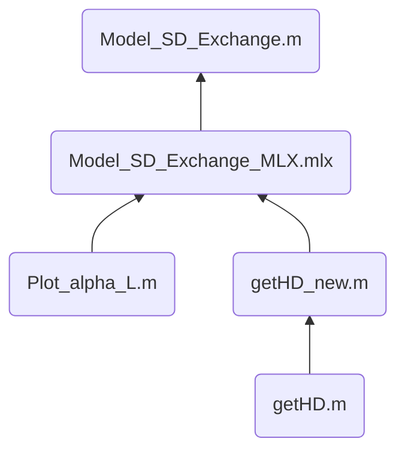

# Bootstrapped Switch

> 对自举开关的失真行为进行建模，旨在找到各个频率下**影响自举开关线性度的误差源**，从而优化自举开关设计，实现高速、高线性度的自举开关结构，**用于高速、高精度 ADC 的采样前端**。

## :pushpin:TODO
- [ ] 完成关于在导通过程中源漏互换的**显式解**；
- [ ] 完成关于在导通过程中寄生电容的**误差源建模**;
- [ ] 完成开启瞬间的电荷分配的**误差源建模**；
  - [ ] 需要注意关于输出端 Vout 的电压值对电荷分配的影响；

## :wrench:Developing

- ✗ `Model_basic.m`: calculate the Id and Vout of the Bootstrapped Switches and model the **relationship of Ron and THD**; **first try**

- ✔︎`Id_getFR.m`: calculated the **frequency response of Id system**;

- ✔︎`getHD.m`: used the **linear equation group of Ron and HD** to calculate the  total distortion, with the variable fin and Ron, the function supportes the **vector** calculation;

- ✔︎`Model_DeltaRon.mlx`: analysis the relationship of Ron, Fin and HD, <- `getHD.m`;

  

## :inbox_tray:Archive

### 001. Phase Order

**存储路径：**`~/Model/`

**问题来源：** 当输入信号频率 Fin 非常接近奈奎斯特频率 Fs/2 时，采样波形此时已无法看出波形的本质了，当我们使用 FFT 对信号进行处理时，**往往会忽略 FFT 信号中的相位信息**，对我们 debug 没有任何帮助；

**解决方法：** 对输入信号**根据相位大小进行重排**，将原本N个看似“不完整“的正弦信号整理为 [0, 2*pi) 的一个正弦信号；

#### 文件结构：

#### 函数介绍

- :star: `PhaseOrder.m`: 根据输入信号进行重排，不支持向量输入，返回带有 `Index`, `Value`, `PhaseOrder` 的 **table**;
  
- `PlotSpectrum.m`: 根据输入信号绘制频谱图，**支持向量输入**，返回频率点 f (Hz) 与 对应功率谱 P (dB);
  
- 

### 002. Bootstrapped Switches in  Simulink

**存储路径：** `~/Simulink/`

**问题来源：** 在没有 Cadence Virtuoso 的情况下，利用 Simulink **对自举开关的源漏互换行为**进行建模；

**解决方案：** 以 Simulink 自带的 `Variable Resistance` 为基础，修改模型文件使得导通电阻满足源漏互换特性，即：

- 导通电阻阻值 $R_{on}$ 与两端电压 $V_1 - V_2$ 有关；
- 当两端电压 $V_1 - V_2 > 0$ 时，导通电阻阻值 $R_{on} \propto V_1 - V_2$ ; 
- 当两端电压 $V_1 - V_2 < 0$ 时，导通电阻阻值 $R_{on} = R_{on0}$ ; 

#### 文件结构：

#### 函数介绍
- `myr.scc`：根据 **variable resistor** 改编而来，输入为电阻R0， 输出为Min{R_max, R}；

- `Resistors.slx`, `Resistor_inverted.slx`: 为 **myr.scc** 的两个仿真测试文件，基本已弃用;

- :star:`onSwitch.scc`: 根据 **myr.scc** 改编而来，含有4个 `electrical node`，**vp,vn** are used to sense the control voltage, **导通电阻阻值符合MOSFET的源漏互换行为**；

- :star:`Bootstrapped_Switch_v1.slx`,`Bootstrapped_Switch_v2.slx`: 为 **onSwitch.scc** 的两个仿真测试文件，输出信号导出至 workspace，用 `Spectrum_Analysis.mlx` 文件计算输出信号的总谐波失真 THD；

-

### 003. S/D Exchange in *On State*

**存储路径：** `~/Modle/`

**问题描述：** 在采样的过程中，输出电压必然**滞后**于输入信号，使得晶体管源漏不停地发生交换，而源漏互换导致晶体管的Vgs不停地变化，使得自举开关的**导通电阻无法在采样时保持稳定**；

**解决方案：** 利用**线性方程组**计算导通电阻中的基频与二次谐波，由**基频与二次谐波**计算得到输出信号的总谐波失真（THD）；

#### 文件结构

- `getHD.m`: 根据系数矩阵计算输出信号的二次谐波与三次谐波，但是没有考虑到长度 L 对 阈值电压 Vth 的影响，基本已弃用；

- :star: `getHD_new.m`：根据系数矩阵计算输出信号的二次谐波与三次谐波，**用参数 α 体现长度 L 的影响**；
  
- :star: `Plot_alpha_L.m`： 作为 **getHD_new.m** 的查表文件，记录了1um内的常用α值；
